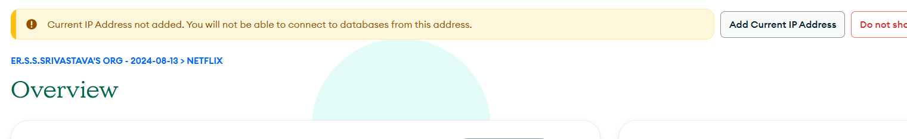

## Description
Here is the simple step how to connect with mongoDB.

## Steps are:
1. https://www.mongodb.com/cloud/atlas/register (First Register or sign in)
2. 
Now click on Add current IP Adress 
3. After connecting install mongoDB and click on connect to connect with server.